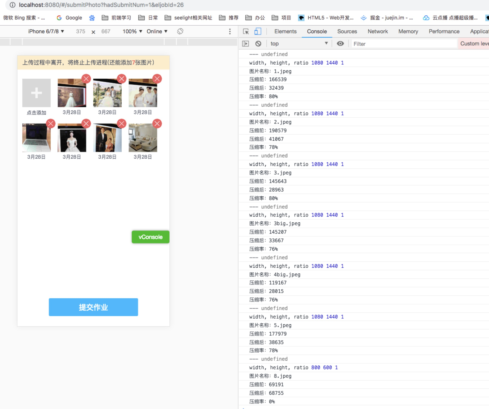
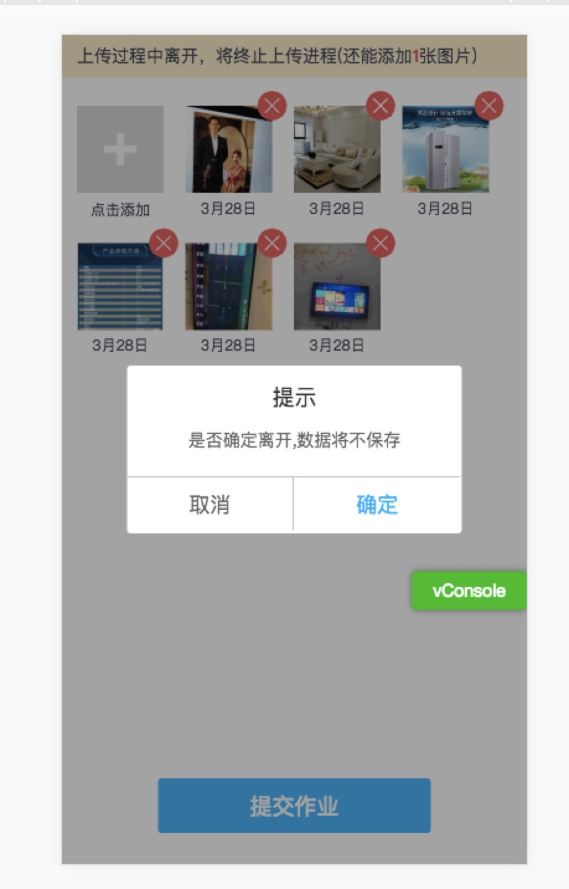

Copyright (c) <year> <copyright holders>

"Anti 996" License Version 1.0 (Draft)

Permission is hereby granted to any individual or legal entity
obtaining a copy of this licensed work (including the source code,
documentation and/or related items, hereinafter collectively referred
to as the "licensed work"), free of charge, to deal with the licensed
work for any purpose, including without limitation, the rights to use,
reproduce, modify, prepare derivative works of, distribute, publish
and sublicense the licensed work, subject to the following conditions:

1. The individual or the legal entity must conspicuously display,
without modification, this License and the notice on each redistributed
or derivative copy of the Licensed Work.

2. The individual or the legal entity must strictly comply with all
applicable laws, regulations, rules and standards of the jurisdiction
relating to labor and employment where the individual is physically
located or where the individual was born or naturalized; or where the
legal entity is registered or is operating (whichever is stricter). In
case that the jurisdiction has no such laws, regulations, rules and
standards or its laws, regulations, rules and standards are
unenforceable, the individual or the legal entity are required to
comply with Core International Labor Standards.

3. The individual or the legal entity shall not induce, metaphor or force
its employee(s), whether full-time or part-time, or its independent
contractor(s), in any methods, to agree in oral or written form, to
directly or indirectly restrict, weaken or relinquish his or her
rights or remedies under such laws, regulations, rules and standards
relating to labor and employment as mentioned above, no matter whether
such written or oral agreements are enforceable under the laws of the
said jurisdiction, nor shall such individual or the legal entity
limit, in any methods, the rights of its employee(s) or independent
contractor(s) from reporting or complaining to the copyright holder or
relevant authorities monitoring the compliance of the license about
its violation(s) of the said license.

THE LICENSED WORK IS PROVIDED "AS IS", WITHOUT WARRANTY OF ANY KIND,
EXPRESS OR IMPLIED, INCLUDING BUT NOT LIMITED TO THE WARRANTIES OF
MERCHANTABILITY, FITNESS FOR A PARTICULAR PURPOSE AND NONINFRINGEMENT.
IN NO EVENT SHALL THE COPYRIGHT HOLDER BE LIABLE FOR ANY CLAIM,
DAMAGES OR OTHER LIABILITY, WHETHER IN AN ACTION OF CONTRACT, TORT OR
OTHERWISE, ARISING FROM, OUT OF OR IN ANY WAY CONNECTION WITH THE
LICENSED WORK OR THE USE OR OTHER DEALINGS IN THE LICENSED WORK.

# submit_photo
a project about submit_photo

## 图片提交异步问题
每次提交完成要显示照片日期，循环提交图片， 因为请求是异步的，如何保证每次请求回来的结果和当前提交图片一一对应？
在每次调提交接口前new Date 一个时间戳塞到每个图片对象里，在提交结果返回时，找到对应的时间，将返回结果塞到对应图片对象，即可

## 图片压缩
用canvas将图片画出来，用canvas.toDataUrl(type, 0.1)来压缩图片再将得到的base64上传到服务器

## ios或者安卓手机上传竖拍照片旋转90度显示问题
利用exif.js读取照片的拍摄信息，详见  [exif.js官网](http://code.ciaoca.com/javascript/exif-js/)

## 图片预览
用了w-previewimg 插件

